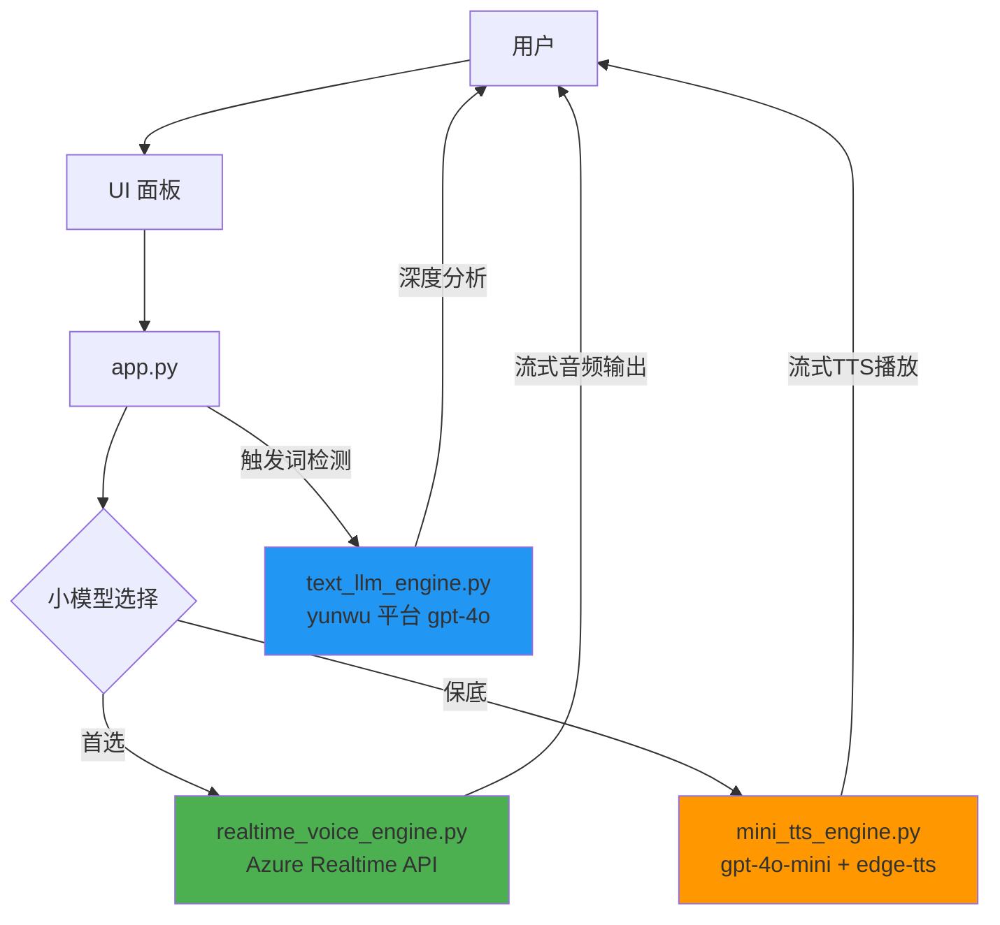

# TEM 模拟器项目结构分析

## 📁 当前项目结构

```
TEM_Agent/
├── app.py                              # ✅ 主应用入口 - 整合三引擎架构
├── config.py                           # ✅ 配置文件 - 包含三引擎配置
├── requirements.txt                    # ✅ 依赖清单
├── test_dual_engines.py                # ✅ 三引擎测试脚本（已更新）
│
├── components/                         # ✅ UI 组件
│   ├── __init__.py
│   └── avatar.py                       # ✅ 头像组件
│
├── data/                               # 数据模块
│   ├── __init__.py
│   ├── mock_data.py                    # ✅ 模拟数据
│   └── knowledge_base.py               # ⚠️ 未使用 - 建议删除
│
├── engines/                            # 引擎模块
│   ├── __init__.py
│   ├── realtime_voice_engine.py        # ✅ 小模型引擎1 - Azure Realtime API
│   ├── mini_tts_engine.py              # ✅ 小模型引擎2 - gpt-4o-mini + edge-tts（保底）
│   ├── text_llm_engine.py              # ✅ 大模型引擎 - yunwu 平台
│   ├── voice_engine.py                 # ❌ 旧版引擎 - 建议删除（已被三引擎替代）
│   └── dual_model_manager.py           # ❌ 旧版管理器 - 建议删除（已被 app.py 替代）
│
├── ui/                                 # UI 模块
│   ├── __init__.py
│   └── panels.py                       # ✅ UI 面板组件
│
└── [测试/调试文件]                     # 历史遗留的测试文件
    ├── realtime_voice_agent.py         # ⚠️ 早期测试文件 - 可选删除
    ├── realtime_voice_agent_streaming.py  # ⚠️ 早期测试文件 - 可选删除
    └── text-in-audio-out.py            # ⚠️ 原始示例文件 - 可选删除
```

---

## 🗑️ 可弃置代码清单

### 1️⃣ 必须删除（已完全废弃）

| 文件路径 | 原因 | 被替代方案 |
|---------|------|-----------|
| `engines/voice_engine.py` | 旧版单体引擎，无任何引用 | `realtime_voice_engine.py` + `mini_tts_engine.py` + `text_llm_engine.py` |
| `engines/dual_model_manager.py` | 旧版双模型管理器，仅被废弃的 voice_engine.py 使用 | `app.py` 中的双引擎逻辑 + `TextLLMEngine.analyze_with_context()` |
| `data/knowledge_base.py` | 知识库模块，从未被使用 | 无（未实现的功能） |

**影响评估**: 删除这些文件不会影响任何功能，因为它们没有被任何活跃代码引用。

---

### 2️⃣ 建议移动到归档目录（测试/示例文件）

| 文件路径 | 类型 | 建议操作 |
|---------|------|---------|
| `realtime_voice_agent.py` | 早期测试脚本 | 移动到 `archive/` 或 `examples/` |
| `realtime_voice_agent_streaming.py` | 早期测试脚本 | 移动到 `archive/` 或 `examples/` |
| `text-in-audio-out.py` | Azure Realtime API 原始示例 | 移动到 `archive/` 或 `examples/` |

**建议**: 创建 `archive/` 目录保存这些历史文件，便于日后参考。

---

### 3️⃣ 需要保留的核心文件

#### 核心应用层
- ✅ `app.py` - 主应用入口，整合三引擎架构
- ✅ `config.py` - 配置文件，支持引擎降级策略

#### 引擎层（三引擎架构）
- ✅ `engines/realtime_voice_engine.py` - 小模型引擎1（Azure Realtime API，首选）
- ✅ `engines/mini_tts_engine.py` - 小模型引擎2（gpt-4o-mini + edge-tts，保底方案）
- ✅ `engines/text_llm_engine.py` - 大模型引擎（yunwu 平台，深度分析）

#### UI 层
- ✅ `ui/panels.py` - 左、中、右三面板
- ✅ `components/avatar.py` - 头像组件

#### 数据层
- ✅ `data/mock_data.py` - 模拟数据

#### 测试工具
- ✅ `test_dual_engines.py` - 三引擎独立测试脚本

---

## 🔄 当前架构总结

### 三引擎架构



### 引擎降级策略

1. **首选**: `realtime` - Azure Realtime API（超低延迟，流式音频）
2. **保底**: `mini_tts` - gpt-4o-mini + edge-tts（成本低，稳定性高）
3. **深度分析**: `gpt-4o` 大模型（触发词：查找、查阅、查询、搜索、让我）

配置文件 `config.py` 中的 `ENGINE_FALLBACK_ORDER` 控制降级顺序：
```python
ENGINE_FALLBACK_ORDER = ["realtime", "mini_tts"]
```

---

## 🧹 清理建议

### 步骤 1: 删除废弃代码

```bash
# 删除完全废弃的文件
rm engines/voice_engine.py
rm engines/dual_model_manager.py
rm data/knowledge_base.py
```

### 步骤 2: 归档测试文件

```bash
# 创建归档目录
mkdir -p archive/early_tests

# 移动早期测试文件
mv realtime_voice_agent.py archive/early_tests/
mv realtime_voice_agent_streaming.py archive/early_tests/
mv text-in-audio-out.py archive/early_tests/
```

### 步骤 3: 清理缓存

```bash
# 删除 Python 缓存
find . -type d -name "__pycache__" -exec rm -rf {} + 2>/dev/null
find . -type f -name "*.pyc" -delete
```

---

## 📊 代码规模统计

### 清理前
- 总文件数: ~19 个 Python 文件
- 活跃文件: 11 个
- 废弃文件: 3 个
- 测试文件: 4 个
- 工具文件: 1 个

### 清理后
- 总文件数: ~12 个 Python 文件（核心代码）
- 归档文件: 3 个（保留在 archive/）

### 代码质量提升
- ✅ 消除死代码
- ✅ 清晰的模块职责
- ✅ 易于维护和调试
- ✅ 降低认知负担

---

## 🎯 最终目录结构（推荐）

```
TEM_Agent/
├── app.py                              # 主应用入口
├── config.py                           # 配置文件
├── requirements.txt                    # 依赖清单
├── test_dual_engines.py                # 三引擎测试脚本
│
├── components/                         # UI 组件
│   └── avatar.py
│
├── data/                               # 数据模块
│   └── mock_data.py
│
├── engines/                            # 三引擎架构
│   ├── realtime_voice_engine.py        # 小模型引擎1
│   ├── mini_tts_engine.py              # 小模型引擎2
│   └── text_llm_engine.py              # 大模型引擎
│
├── ui/                                 # UI 模块
│   └── panels.py
│
└── archive/                            # 归档文件（可选）
    └── early_tests/
        ├── realtime_voice_agent.py
        ├── realtime_voice_agent_streaming.py
        └── text-in-audio-out.py
```

---

## ✅ 行动清单

- [ ] 1. 删除 `engines/voice_engine.py`
- [ ] 2. 删除 `engines/dual_model_manager.py`
- [ ] 3. 删除 `data/knowledge_base.py`
- [ ] 4. 创建 `archive/early_tests/` 目录
- [ ] 5. 移动早期测试文件到归档目录
- [ ] 6. 清理 `__pycache__` 缓存
- [ ] 7. 更新 `.gitignore`（忽略 `__pycache__`、`*.pyc`）
- [ ] 8. 运行 `test_dual_engines.py` 确保清理后功能正常

---

生成时间: 2025-11-19
生成工具: Claude Code
