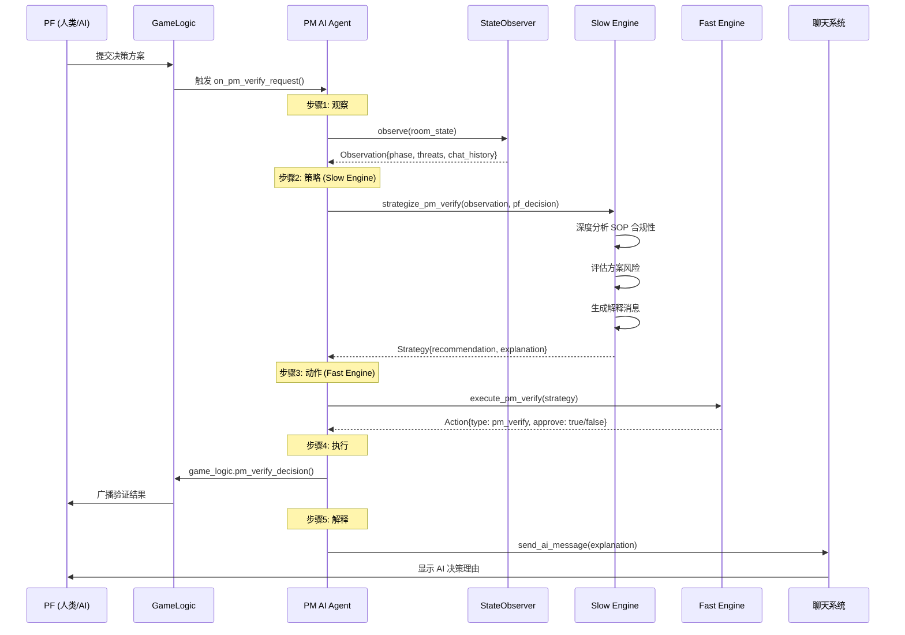
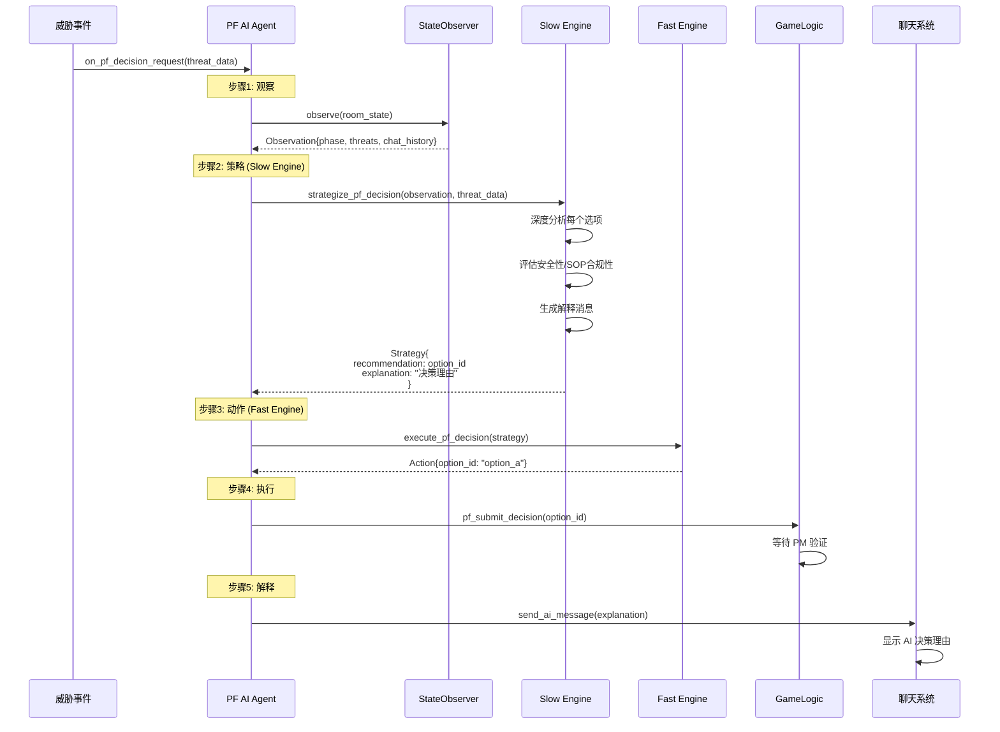

# C172 TEM 训练器 V2 - 双过程 AI 协作训练系统

基于 Web 的航空 TEM (Threat and Error Management) 训练系统，支持**双人协作**或**单人+AI**两种模式。AI 采用**双过程认知架构**，模拟人类飞行员的快速反应与深度推理。

---

## 系统架构

```
┌─────────────────────────────────────────────────────────────────────────────┐
│                              Web Frontend (index.html)                       │
│  ┌──────────────┐  ┌──────────────┐  ┌──────────────┐  ┌──────────────────┐ │
│  │   仪表盘      │  │  对话面板     │  │  QRH 检查单   │  │  TTS 语音播放    │ │
│  └──────────────┘  └──────────────┘  └──────────────┘  └──────────────────┘ │
└─────────────────────────────────────────────────────────────────────────────┘
                                    │ SocketIO
                                    ▼
┌─────────────────────────────────────────────────────────────────────────────┐
│                            Flask-SocketIO Server (app_web.py)               │
│  ┌────────────────────────────────────────────────────────────────────────┐ │
│  │                         GameLogic (game_logic.py)                      │ │
│  │    统一业务逻辑层：人类和AI调用相同的接口                                   │ │
│  │    • pf_identify_threat()   • pm_verify_decision()   • select_qrh()   │ │
│  │    • pf_submit_decision()   • submit_quiz_answer()   • check_item()   │ │
│  └────────────────────────────────────────────────────────────────────────┘ │
│                                    │                                         │
│          ┌─────────────────────────┴─────────────────────────┐              │
│          ▼                                                   ▼              │
│  ┌───────────────┐                                  ┌─────────────────────┐ │
│  │  Human Player │                                  │ DualProcessAIAgent  │ │
│  │  (via Socket) │                                  │  (engines/ai_agent) │ │
│  └───────────────┘                                  └─────────────────────┘ │
└─────────────────────────────────────────────────────────────────────────────┘
                                                               │
                    ┌──────────────────────────────────────────┼──────────────┐
                    │              AI Agent 双过程架构                         │
                    │                                                          │
                    │   ┌─────────────┐      ┌─────────────┐                  │
                    │   │ Fast Engine │      │ Slow Engine │                  │
                    │   │ (System 1)  │      │ (System 2)  │                  │
                    │   │ gpt-4o-mini │      │   gpt-4o    │                  │
                    │   │ 快速响应     │      │ 深度推理     │                  │
                    │   └─────────────┘      └─────────────┘                  │
                    │          │                    │                          │
                    │          └────────┬───────────┘                          │
                    │                   ▼                                      │
                    │         ┌─────────────────┐                              │
                    │         │  决策融合输出    │                              │
                    │         └─────────────────┘                              │
                    └──────────────────────────────────────────────────────────┘
```

---

## 双过程 AI Agent 架构

### 核心理念

借鉴 Kahneman 的双过程理论：
- **System 1 (Fast Engine)**: 快速、直觉、自动化响应
- **System 2 (Slow Engine)**: 慢速、深思熟虑、策略性推理

### 组件结构

```
engines/
├── ai_agent.py              # DualProcessAIAgent 主类
├── text_llm_engine.py       # LLM 调用封装
└── ai_core/
    ├── models.py            # 数据模型 (Observation, Strategy, Action)
    ├── observer.py          # StateObserver 观察层
    ├── strategies.py        # StrategyGenerator 策略层 (Slow Engine)
    ├── executor.py          # ActionExecutor 执行层 (Fast Engine)
    └── utils.py             # 工具函数
```

### 数据流模型

```
┌─────────────────────────────────────────────────────────────────────────────┐
│                        Observation → Strategy → Action                       │
│                                                                              │
│  ┌───────────────┐     ┌───────────────┐     ┌───────────────┐             │
│  │   Observation  │────▶│   Strategy    │────▶│    Action     │             │
│  │  (观察结果)     │     │  (策略建议)    │     │  (具体动作)    │             │
│  │               │     │               │     │               │             │
│  │ • phase       │     │ • thinking    │     │ • action_type │             │
│  │ • role        │     │ • assessment  │     │ • params      │             │
│  │ • threats     │     │ • recommend.  │     │ • priority    │             │
│  │ • gauges      │     │ • explanation │     │               │             │
│  │ • context     │     │               │     │               │             │
│  └───────────────┘     └───────────────┘     └───────────────┘             │
│         ▲                     ▲                     │                       │
│         │                     │                     ▼                       │
│  ┌──────┴──────┐       ┌──────┴──────┐       ┌────────────┐                │
│  │ StateObserver│       │StrategyGen │       │ActionExec  │                │
│  │ (纯逻辑提取)  │       │(Slow Engine)│       │(Fast Engine)│                │
│  └─────────────┘       └─────────────┘       └────────────┘                │
└─────────────────────────────────────────────────────────────────────────────┘
```

---

## 双过程决策流程

### PM 验证 PF 决策 (完整新架构示例)



### PF 威胁决策 (新架构 - 观察→策略→动作→执行)



**架构说明：**
- ✅ **统一架构**：PF 和 PM 现在使用相同的 观察→策略→动作→执行 流程
- ✅ **Slow Engine 主导**：深度分析，生成决策 + 解释
- ✅ **Fast Engine 转换**：快速将策略转为动作格式
- ✅ **决策解释**：AI 会通过聊天解释自己的决策理由

---

## 训练模式

### 双人协作模式

```
┌─────────────────┐          ┌─────────────────┐
│     PF (人类)    │◄────────►│     PM (人类)    │
│                 │  房间号   │                 │
│  • 识别威胁      │  同步     │  • 验证决策      │
│  • 提出方案      │          │  • SOP检查      │
│  • 选择QRH      │          │  • 答题测试      │
└─────────────────┘          └─────────────────┘
```

### 单人+AI模式

```
┌─────────────────┐          ┌─────────────────┐
│     PF (人类)    │◄────────►│    PM (AI)      │
│                 │  实时     │                 │
│  • 识别威胁      │  协作     │  • 双过程决策    │
│  • 提出方案      │          │  • 解释理由      │
│  • 选择QRH      │          │  • 语音播报      │
└─────────────────┘          └─────────────────┘

或

┌─────────────────┐          ┌─────────────────┐
│     PF (AI)     │◄────────►│     PM (人类)    │
│                 │  实时     │                 │
│  • 自动识别威胁  │  协作     │  • 验证决策      │
│  • 双过程决策    │          │  • SOP检查      │
│  • 解释理由      │          │  • 答题测试      │
└─────────────────┘          └─────────────────┘
```

---

## 核心模块说明

### GameLogic (game_logic.py)

统一的业务逻辑层，人类和AI调用相同的接口：

| 方法 | 说明 | 调用者 |
|------|------|--------|
| `pf_identify_threat()` | PF 识别威胁关键词 | PF |
| `pf_submit_decision()` | PF 提交决策方案 | PF |
| `pm_verify_decision()` | PM 验证 PF 决策 | PM |
| `submit_quiz_answer()` | 提交测试题答案 | PM |
| `select_qrh()` | 选择 QRH 检查单 | PF/PM |
| `check_item()` | 完成检查单项目 | PF/PM |
| `monitor_gauge()` | 标记仪表监控 | PF/PM |
| `send_ai_message()` | AI 发送聊天消息 | AI |

### DualProcessAIAgent (engines/ai_agent.py)

AI Agent 主类，管理双过程决策：

| 方法 | 触发时机 | 引擎 |
|------|----------|------|
| `on_phase1_start()` | Phase 1 开始 | - |
| `on_pf_decision_request()` | PF 需要决策 | Fast + Slow |
| `on_pm_verify_request()` | PM 需要验证 | Slow → Fast |
| `on_quiz_questions()` | 测试题出现 | Fast |
| `on_event_alert()` | 事件警报触发 | Fast |
| `on_checklist_shown()` | 显示检查单 | Fast |
| `on_chat_message()` | 收到聊天消息 | Fast |

### StateObserver (engines/ai_core/observer.py)

观察层 - 从房间状态提取结构化信息：

```python
@dataclass
class Observation:
    phase: str           # 当前阶段 (phase1/phase2/phase3)
    role: str            # AI 角色 (PF/PM)
    threats: Dict        # 已识别威胁及处理状态
    pending_decision: Dict  # 当前待验证决策
    gauges: Dict         # 仪表状态
    events: List         # 事件队列
    context: Dict        # 聊天历史等上下文
```

### StrategyGenerator (engines/ai_core/strategies.py)

策略层 - Slow Engine 深度推理：

```python
@dataclass
class Strategy:
    thinking: str        # 思考过程
    assessment: Dict     # 评估结果 {threat_recognized, sop_compliance}
    recommendation: Dict # 建议 {action, confidence, reasoning}
    next_focus: str      # 下一步关注点
    explanation: str     # 向用户解释的消息
```

### ActionExecutor (engines/ai_core/executor.py)

执行层 - Fast Engine 快速转化：

```python
@dataclass
class Action:
    action_type: str     # 动作类型 (pm_verify_decision, select_qrh, etc.)
    params: Dict         # 动作参数 {approve: bool, qrh_key: str, etc.}
    priority: str        # 优先级 (high/medium/low)
```

---

## 技术特性

### TTS 语音播放 (线程隔离架构)

```
┌─────────────────┐     ┌─────────────────┐     ┌─────────────────┐
│  Eventlet 主线程 │────▶│  线程安全队列    │────▶│  TTS 工作线程    │
│                 │     │  queue.Queue()  │     │                 │
│  • SocketIO     │     │                 │     │  • 独立asyncio  │
│  • GameLogic    │     │                 │     │  • edge-tts     │
│  • AI Agent     │     │                 │     │  • 并行生成      │
└─────────────────┘     └─────────────────┘     └─────────────────┘
                                                        │
                                                        ▼
                                               ┌─────────────────┐
                                               │  前端音频播放    │
                                               │  • 句子级流式    │
                                               │  • 顺序播放队列  │
                                               └─────────────────┘
```

### 机组通信系统

- 双向聊天：PF 和 PM 可以实时文字交流
- AI 监听：AI 监听所有消息，判断是否需要回复
- 决策解释：Slow Engine 生成决策理由，通过聊天发送
- TTS 语音：AI 消息可选语音播报

---

## 快速开始

### 环境配置

```bash
# 1. 创建虚拟环境
python -m venv .venv
source .venv/bin/activate

# 2. 安装依赖
pip install -r requirements.txt

# 3. 配置 API Key (config.py)
OPENAI_API_KEY = "your-api-key"
CUSTOM_BASE_URL = "https://api.openai.com/v1"  # 或自定义
```

### 启动服务

```bash
python app_web.py
# 访问 http://127.0.0.1:5001
```

### 模式选择

1. **双人模式**: 两人输入相同房间号，分别选择 PF/PM
2. **单人+AI模式**: 选择 "单人+AI模式"，AI 自动扮演另一角色

---

## 项目结构

```
TEM_Agent/
├── app_web.py                 # Flask-SocketIO 服务器
├── game_logic.py              # 统一业务逻辑层
├── config.py                  # 配置文件 (API Key, 模型参数)
├── requirements.txt           # Python 依赖
│
├── templates/
│   └── index.html             # Web 前端 (单页应用)
│
├── engines/                   # AI 引擎模块
│   ├── ai_agent.py            # DualProcessAIAgent 主类
│   ├── text_llm_engine.py     # LLM API 封装
│   └── ai_core/               # AI 核心组件
│       ├── models.py          # 数据模型
│       ├── observer.py        # 观察层
│       ├── strategies.py      # 策略层 (Slow Engine)
│       ├── executor.py        # 执行层 (Fast Engine)
│       └── utils.py           # 工具函数
│
├── data/                      # 数据配置
│   ├── phase1_data.py         # Phase 1 威胁库
│   ├── phase2_advanced.py     # Phase 2 多事件场景
│   └── qrh_library.py         # QRH 检查单库
│
└── logs/                      # 操作日志 (自动生成)
    └── session_*.jsonl
```

---

## 训练流程

| Phase | 名称 | PF 职责 | PM 职责 | AI 能力 |
|-------|------|---------|---------|---------|
| **Phase 1** | 起飞前威胁管理 | 识别威胁、提出方案 | 验证决策、答题测试 | 双过程决策、解释理由 |
| **Phase 2** | 空中征兆检测 | 监控仪表、选择QRH | 监控仪表、选择QRH | 异常检测、QRH匹配 |
| **Phase 3** | 应急程序执行 | 执行检查单 | 执行检查单 | 协作执行 |

---

## 许可证

MIT License
